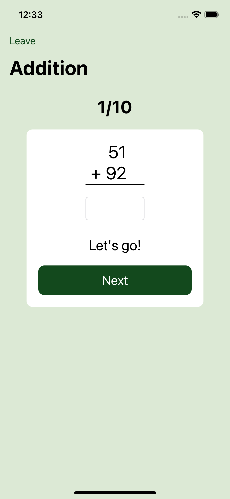
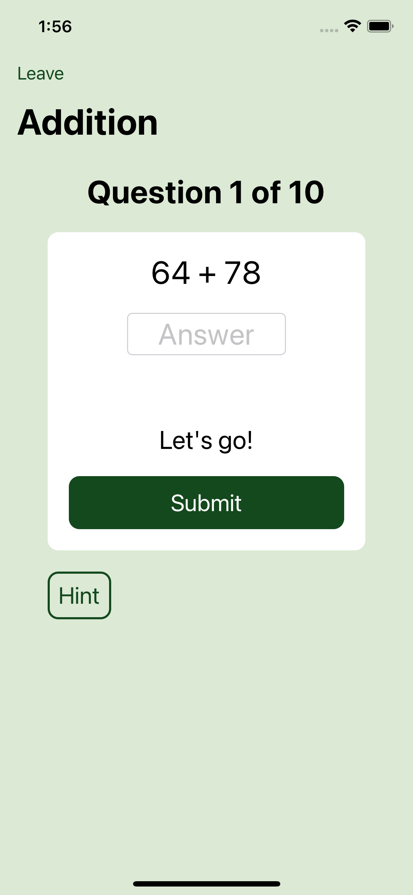
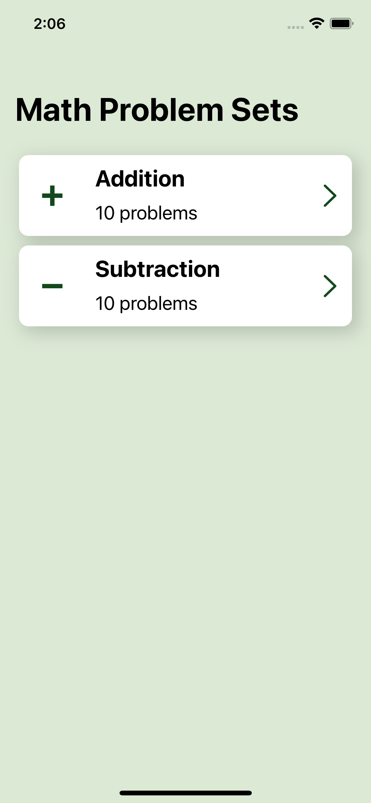
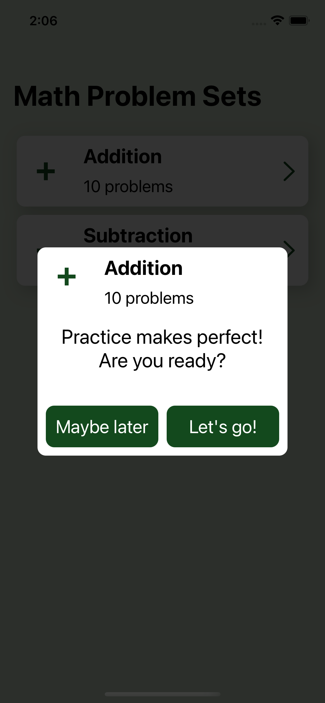
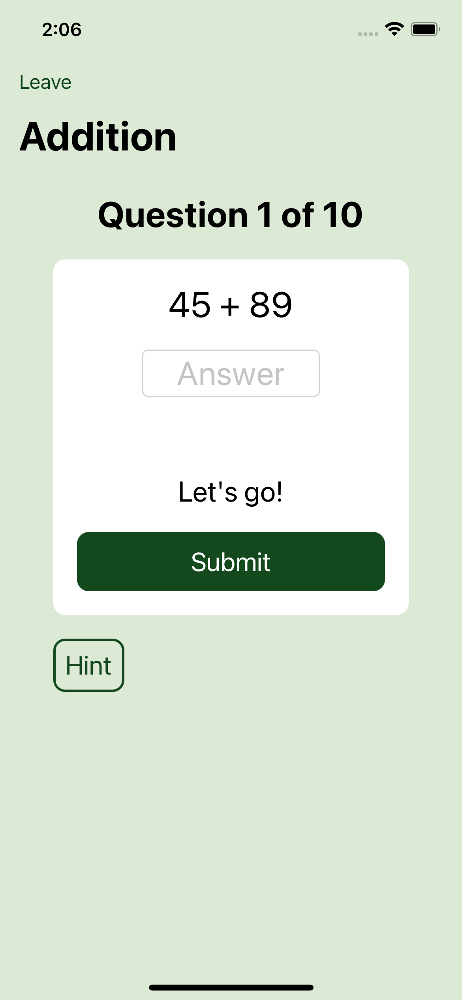
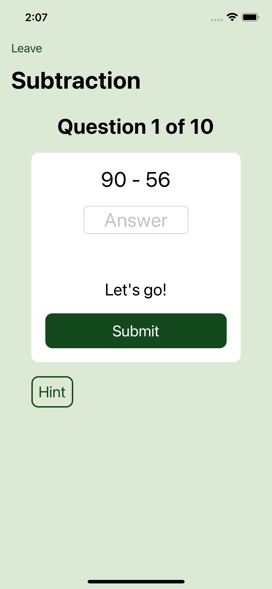
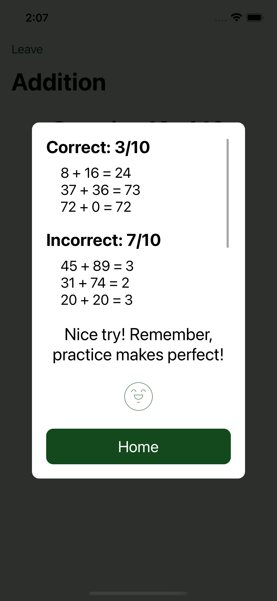

# PaulTheTutorApp
Version 1.0 of the math practice app.

## Previous version vs. Latest version
Changes:
* "1/10" changed to "Question 1 of 10"
* Arranged operands horizontally
* Removed divider line
* Added "Answer" placeholder text
* Added Hint button with no functionality
* Changed "Next" to "Submit"

|||
|:---:|:---:|
|Previous version|Latest version|

## All current screens 
||||
|:---:|:---:|:---:|
|Launch Screen|Dashboard Screen|Selected Test Alert|

||||
|:---:|:---:|:---:|
|Addition Screen|Subtraction Screen|Result Screen|
